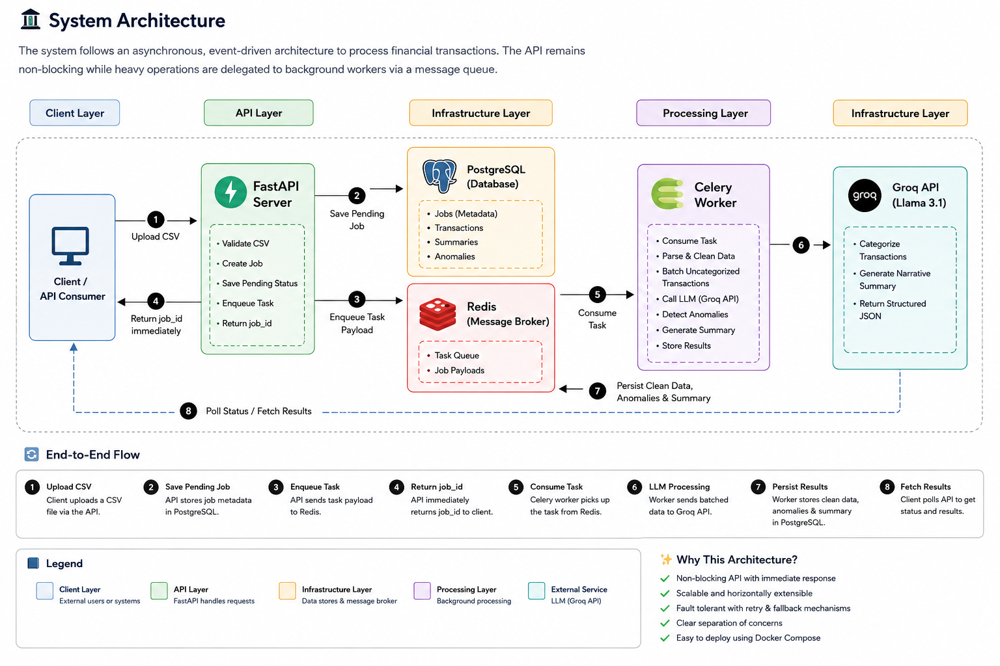

# 🚀 AI-Powered Transaction Processing Pipeline

An asynchronous, event-driven backend system that ingests, cleans, and analyzes financial transaction data. The system uses Large Language Models (LLMs) to categorize transactions, detect anomalies, and generate structured financial summaries while keeping the API responsive through background processing.

# 🏗️ System Architecture

<div align="center">
  
</div>

<p align="center">
  <em>
  Asynchronous, event-driven pipeline for processing financial transactions
  using FastAPI, Celery, Redis, PostgreSQL, and Groq LLM.
  </em>
</p>

# ✨ Features

- ⚡ **Asynchronous Processing** – Long-running tasks are executed by Celery workers, ensuring low API latency.
- 🧠 **LLM-Powered Transaction Analysis** – Automatically categorizes transactions and generates financial narratives.
- 📦 **Batch Processing Optimization** – Transactions are processed in batches to minimize LLM API calls and reduce costs.
- 🔄 **Fault Tolerance & Retry Mechanism** – External API failures are handled using retry strategies and graceful fallbacks.
- 📊 **Anomaly Detection** – Identifies unusual spending patterns and suspicious transactions.
- 🐳 **Containerized Deployment** – Entire infrastructure runs using Docker Compose for easy setup and deployment.
- 🛡️ **Production-Oriented Design** – Built with scalability, maintainability, and resilience in mind.

---

# 🛠️ Tech Stack

| Component | Technology |
|-----------|------------|
| Backend Framework | FastAPI |
| Task Queue | Celery |
| Message Broker | Redis |
| Database | PostgreSQL |
| ORM | SQLAlchemy |
| AI/LLM | Groq API (Llama-3.1-8B-Instant) |
| Containerization | Docker & Docker Compose |
| Data Validation | Pydantic |
| File Processing | Pandas |

---

# 📂 Project Structure

```bash
.
├── app/
│   ├── api/
│   ├── models/
│   ├── schemas/
│   ├── services/
│   ├── workers/
│   └── utils/
├── uploads/
├── docker-compose.yml
├── Dockerfile
├── requirements.txt
├── .env
└── README.md
```

---

# 🚀 Getting Started

## 1️⃣ Clone the Repository

```bash
git clone https://github.com/your-username/backend_assignment.git
cd backend_assignment
```

---

## 2️⃣ Configure Environment Variables

Create a `.env` file in the root directory:

```env
GROQ_API_KEY=your_groq_api_key
DATABASE_URL=postgresql://postgres:postgres@db:5432/transactions
REDIS_URL=redis://redis:6379/0
```

---

## 3️⃣ Start the Application

```bash
docker compose up -d --build
```

Verify that all services are running:

```bash
docker ps
```

---

## 4️⃣ Access the Services

| Service | URL |
|---------|-----|
| FastAPI | http://localhost:8000 |
| Swagger Documentation | http://localhost:8000/docs |
| PostgreSQL | localhost:5433 |
| Redis | localhost:6379 |

---

# 📡 API Endpoints

## Upload Transactions

Uploads a CSV file and starts background processing.

**Endpoint**

```http
POST /jobs/upload
```

**Request**

```bash
multipart/form-data
```

**Response**

```json
{
  "job_id": "506e60fe-bd49-4f64-bc55-630251d4e4a4",
  "status": "pending"
}
```

---

## Check Job Status

**Endpoint**

```http
GET /jobs/{job_id}/status
```

**Response**

```json
{
  "job_id": "506e60fe-bd49-4f64-bc55-630251d4e4a4",
  "status": "completed",
  "summary": {
    "narrative": "Monthly expenses increased by 15% due to travel spending.",
    "risk_level": "medium",
    "anomaly_count": 5
  }
}
```

---

## Fetch Final Results

**Endpoint**

```http
GET /jobs/{job_id}/results
```

**Response**

```json
{
  "job_id": "506e60fe-bd49-4f64-bc55-630251d4e4a4",
  "transactions": [],
  "summary": {
    "narrative": "Monthly expenses increased by 15% due to travel spending.",
    "risk_level": "medium",
    "anomaly_count": 5
  }
}
```

---

# 🔄 Processing Workflow

1. User uploads a CSV file.
2. FastAPI creates a new processing job.
3. Job metadata is stored in PostgreSQL.
4. Task payload is pushed to Redis.
5. Celery worker consumes the task.
6. Transactions are cleaned and categorized.
7. LLM generates summaries and insights.
8. Results are stored in PostgreSQL.
9. User polls the API to retrieve results.

---

# 🐳 Docker Services

```yaml
services:
  - api
  - worker
  - postgres
  - redis
```

Start:

```bash
docker compose up -d
```

Stop:

```bash
docker compose down
```

View logs:

```bash
docker compose logs -f
```

---

# 📈 Scaling Considerations (100x Traffic)

## 1. Database Connection Bottleneck

**Problem**

Multiple FastAPI and Celery instances can exhaust PostgreSQL's `max_connections`.

**Solution**

- Add PgBouncer for connection pooling.
- Use SQLAlchemy connection pooling.
- Introduce read replicas for heavy read traffic.

---

## 2. File Storage Bottleneck

**Problem**

Saving uploaded files on local Docker volumes causes disk I/O contention and storage limitations.

**Solution**

- Store files in AWS S3 or Google Cloud Storage.
- Use pre-signed upload URLs.
- Trigger processing through storage events.

---

## 3. Queue Throughput

**Problem**

Single Redis instance becomes a bottleneck.

**Solution**

- Use Redis Cluster.
- Deploy multiple Celery workers.
- Introduce task prioritization.

---

## 4. API Scaling

**Problem**

Single FastAPI instance cannot handle large concurrent traffic.

**Solution**

- Deploy multiple API replicas.
- Use Nginx or a cloud load balancer.
- Enable horizontal auto-scaling.

---

# 🛡️ Production Improvements

- JWT Authentication
- Rate Limiting
- Structured Logging
- OpenTelemetry Tracing
- Metrics with Prometheus & Grafana
- CI/CD Pipeline with GitHub Actions
- Kubernetes Deployment
- Health Checks and Readiness Probes
- Dead Letter Queue (DLQ)
- Automated Backups

---

# 🧪 Running Tests

```bash
pytest
```

Run with coverage:

```bash
pytest --cov=app
```

---

# 👨‍💻 Author

**Saksham Vijay**

- GitHub: https://github.com/Sakshamvijay-078
- LinkedIn: https://www.linkedin.com/in/saksham-vijay

---

# ⭐ If you found this project useful, consider giving it a star!